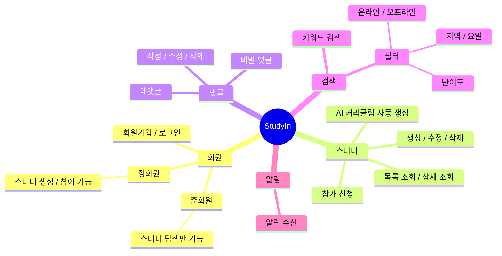
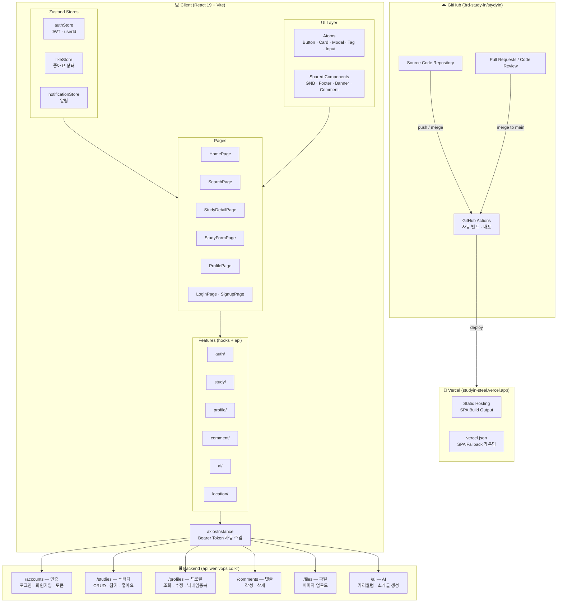

# StudyIn

> 프로그래밍 스터디를 직접 기획하고 운영하기 어려운 학습자들을 위해
> AI 초안 생성 기능과 단계별 권한 시스템을 제공하는 스터디 매칭 플랫폼

<!-- TODO: 서비스 대표 이미지 또는 배너 -->

---

## 1. 목표와 기능

### 1.1 서비스 정의
StudyIn은 프로그래밍 스터디를 직접 기획하고 운영하기 어려운 학습자들을 위해 AI 초안 생성 기능과 GitHub 연동 기반의 신뢰 시스템을 제공하는 스터디 매칭 플랫폼입니다.

### 1.2 서비스 목표
- 스터디 개설 시 발생하는 기획 및 작성 부담 완화
- 학습 데이터 기반의 신뢰도 높은 스터디 구성
- 접근 단계별 권한 설정을 통한 진성 사용자 확보

### 1.3 팀 구성

<!-- TODO: 실제 사진으로 교체 -->
<table>
  <tr>
    <th>김혜진</th>
    <th>강우석</th>
    <th>한유리</th>
    <th>조서연</th>
  </tr>
  <tr>
    <td></td>
    <td></td>
    <td></td>
    <td></td>
  </tr>
  <tr>
    <td>프로젝트 기반 설정 및 주요 페이지 구현</td>
    <td>프로젝트 초기 세팅 및 핵심 기능 개발</td>
    <td>헤더/푸터 및 공통 UI 컴포넌트 개발</td>
    <td>스터디 상세 및 댓글 기능 개발</td>
  </tr>
</table>

---

## 2. 개발 환경 및 배포 URL

### 2.1 개발 환경

**Frontend**
- Library: React 19
- Language: JavaScript
- Styling: Tailwind CSS 4
- Build Tool: Vite 7
- 상태관리: Zustand
- Auth: JWT, axiosInstance
- Linting: ESLint + Prettier

**Collaboration & Infrastructure**
- Version Control: Git, GitHub
- Deployment: Vercel
- Design: Figma

## 인증 방식

- JWT 기반 인증
- `access_token`: 1시간 유효
- `refresh_token`: 7시간 유효
- 이메일 인증 코드는 `123456` 고정 (실제 발송 없음)

### 2.2 배포 URL
- https://studyin-steel.vercel.app
- 테스트 계정
  ```
  id : test@test.com
  pw : test1234!
  ```

### 2.3 페이지 라우팅 구조

> `AuthLayout`(GNBLogin) / `GeneralLayout`(GNB 공개) / `PrivateLayout`(GNB 인증 필요) 세 가지 레이아웃으로 분리

```
/
├── [AuthLayout]
│   ├── /login                    # 로그인
│   └── /signup                   # 회원가입
│
├── [GeneralLayout]               # 비로그인도 접근 가능
│   ├── /                         # 홈 (스터디 목록)
│   ├── /search                   # 검색
│   └── /study/:studyId           # 스터디 상세
│
├── [PrivateLayout]               # 미인증 시 → /login 리다이렉트
│   ├── /study/create             # 스터디 생성
│   ├── /study/:studyId/edit      # 스터디 수정
│   ├── /profile/:userId          # 프로필
│   ├── /profile/create           # 최초 프로필 설정
│   └── /password-reset           # 비밀번호 재설정
│
└── *                             # 404
```

| 페이지 | URL | 접근 권한 | 설명 |
|--------|-----|:---------:|------|
| 홈 | `/` | 전체 | 스터디 목록 메인 페이지 |
| 검색 | `/search` | 전체 | 키워드 및 필터 검색 |
| 스터디 상세 | `/study/:studyId` | 전체 | 스터디 상세 정보 및 댓글 |
| 로그인 | `/login` | 비로그인 | 로그인 페이지 |
| 회원가입 | `/signup` | 비로그인 | 회원가입 페이지 |
| 스터디 생성 | `/study/create` | 정회원 | 스터디 생성 폼 |
| 스터디 수정 | `/study/:studyId/edit` | 정회원(작성자) | 스터디 수정 폼 |
| 프로필 | `/profile/:userId` | 로그인 | 마이페이지 |
| 프로필 생성 | `/profile/create` | 로그인 | 최초 프로필 설정 |
| 비밀번호 재설정 | `/password-reset` | 로그인 | 비밀번호 변경 |
| 404 | `*` | 전체 | 페이지 없음 |

### 2.4 API 엔드포인트

> Base URL: `https://api.wenivops.co.kr/services/studyin`  
> 미인증 요청 시 `401 Unauthorized` 반환

#### app:accounts
| Endpoint | Method | 설명 | 로그인 | 작성자 |
|----------|--------|------|:------:|:------:|
| `signup/` | POST | 회원가입 | | |
| `login/` | POST | 로그인 | | |
| `logout/` | POST | 로그아웃 | ✅ | |
| `token/refresh/` | POST | 만료 토큰 재발급 | | |
| `status/` | GET | 로그인 상태 확인 | | |
| `<int:pk>/` | GET | 프로필 조회 | ✅ | |
| `<int:pk>/` | PATCH | 프로필 수정 | ✅ | ✅ |
| `<int:pk>/` | DELETE | 회원 탈퇴 | ✅ | ✅ |
| `<int:pk>/status/` | PATCH | 준회원 → 정회원 승급 | ✅ | |

#### app:study
| Endpoint | Method | 설명 | 로그인 | 작성자 |
|----------|--------|------|:------:|:------:|
| `studies/` | GET | 스터디 목록 | ✅ | |
| `studies/` | POST | 스터디 생성 | ✅ | |
| `studies/<int:pk>/` | GET | 스터디 상세 | ✅ | |
| `studies/<int:pk>/` | PUT | 스터디 수정 | ✅ | ✅ |
| `studies/<int:pk>/` | DELETE | 스터디 삭제 | ✅ | ✅ |
| `studies/<int:pk>/join/` | POST | 참가 신청 | ✅ | |
| `studies/ai/` | POST | AI 스터디 생성 | ✅ | |

#### app:profile
| Endpoint | Method | 설명 | 로그인 | 작성자 |
|----------|--------|------|:------:|:------:|
| `profile/<int:pk>/` | GET | 프로필 조회 | ✅ | |
| `profile/<int:pk>/` | PATCH | 프로필 설정 | ✅ | ✅ |

#### app:comments
| Endpoint | Method | 설명 | 로그인 | 작성자 |
|----------|--------|------|:------:|:------:|
| `studies/<int:pk>/comments/` | GET | 댓글 목록 | ✅ | |
| `studies/<int:pk>/comments/` | POST | 댓글 작성 | ✅ | |
| `comments/<int:pk>/` | PATCH | 댓글 수정 | ✅ | ✅ |
| `comments/<int:pk>/` | DELETE | 댓글 삭제 | ✅ | ✅ |
| `comments/<int:pk>/reply/` | POST | 대댓글 작성 | ✅ | |
| `comments/<int:pk>/secret/` | PATCH | 비밀댓글 설정 | ✅ | ✅ |

#### app:search
| Endpoint | Method | 설명 | 로그인 | 작성자 |
|----------|--------|------|:------:|:------:|
| `search/` | GET | 키워드 검색 | ✅ | |
| `search/filter/` | GET | 필터 검색 | ✅ | |

#### app:notifications
| Endpoint | Method | 설명 | 로그인 | 작성자 |
|----------|--------|------|:------:|:------:|
| `notifications/` | GET | 알림 목록 조회 | ✅ | |
| `notifications/<int:pk>/read/` | PATCH | 알림 읽음 처리 | ✅ | |

### 2.5 API 응답 데이터 타입

#### 로그인 (POST /accounts/login)
| 필드 | 타입 | 설명 |
|------|------|------|
| access_token | string | JWT 액세스 토큰 |
| refresh_token | string | JWT 리프레시 토큰 |
| user.pk | number | 사용자 고유 ID |
| user.email | string | 이메일 |
| user.uid | string | 가입 경로 식별 ID (NO_: 이메일) |

#### 프로필 (GET /accounts/profile/:userId)
| 필드 | 타입 | 설명 |
|------|------|------|
| user | number | 사용자 ID |
| nickname | string | 닉네임 |
| name | string | 실명 (본인 조회 시만 제공) |
| phone | string | 전화번호 (본인 조회 시만 제공) |
| profile_img | string | 프로필 이미지 경로 |
| introduction | string | 자기소개 |
| preferred_region | object | 선호 지역 {id, location} |
| github_username | string | GitHub 사용자명 |
| tag | array | 기술 태그 목록 [{id, name}] |
| grade | string | 등급 |
| is_associate_member | boolean | 정회원 여부 |

#### 스터디 목록 (GET /study)
| 필드 | 타입 | 설명 |
|------|------|------|
| count | number | 전체 스터디 수 |
| next | string \| null | 다음 페이지 URL |
| previous | string \| null | 이전 페이지 URL |
| results[].id | number | 스터디 ID |
| results[].title | string | 스터디 제목 |
| results[].thumbnail | string | 썸네일 이미지 경로 |
| results[].is_offline | boolean | 오프라인 여부 |
| results[].study_location | string \| null | 스터디 장소 (온라인 시 null) |
| results[].difficulty | object | 난이도 {id, name} |
| results[].subject | object | 주제 {id, name} |
| results[].study_status | object | 모집 상태 {id, name} |
| results[].participant_count | number | 참가자 수 |
| results[].user_liked | boolean | 좋아요 여부 |

#### 스터디 상세 (GET /study/:studyId)
| 필드 | 타입 | 설명 |
|------|------|------|
| id | number | 스터디 ID |
| title | string | 스터디 제목 |
| recruitment | number | 모집 인원 |
| study_info | string | 스터디 소개 |
| leader | object | 스터디장 정보 |
| study_day | array | 스터디 요일 [{id, name}] |
| start_date | string | 시작일 |
| term | number | 기간 (주) |
| start_time | string | 시작 시간 |
| end_time | string | 종료 시간 |
| search_tag | array | 검색 태그 [{id, name}] |
| participants | array | 참가자 목록 |
| like_users | array | 좋아요 사용자 목록 |

#### 댓글 (GET /study/:studyId/comments)
| 필드 | 타입 | 설명 |
|------|------|------|
| id | number | 댓글 ID |
| content | string | 댓글 내용 |
| is_secret | boolean | 비밀 댓글 여부 |
| is_delete | boolean | 삭제 여부 |
| user.id | number | 작성자 ID (비밀 댓글 시 없음) |
| user.profile.nickname | string | 작성자 닉네임 |
| user.profile.profile_img | string | 프로필 이미지 경로 |
| user.is_author | boolean | 스터디장 여부 |
| recomments | array | 대댓글 목록 |

---

## 3. 요구사항 명세와 기능 명세

### 3.1 요구사항 명세



## 회원 등급

| 등급   | 조건             | 가능한 기능                       |
| ------ | ---------------- | --------------------------------- |
| 준회원 | 회원가입 직후    | 스터디 조회만 가능                |
| 정회원 | 프로필 설정 완료 | 스터디 생성, 참가, 댓글 작성 가능 |

### 3.2 기능 명세

| 기능 분류 | 요구사항 | 비로그인 | 준회원 | 정회원 |
|----------|---------|:-------:|:-----:|:-----:|
| 회원 | 회원가입 / 로그인 | ✅ | | |
| 회원 | 프로필 수정 | | ✅ | ✅ |
| 스터디 | 스터디 목록 조회 | ✅ | ✅ | ✅ |
| 스터디 | 스터디 상세 조회 | ✅ | ✅ | ✅ |
| 스터디 | 스터디 생성 / 수정 / 삭제 | | | ✅ |
| 스터디 | 스터디 참가 신청 | | | ✅ |
| 스터디 | AI 커리큘럼 / 소개글 자동 생성 | | | ✅ |
| 댓글 | 댓글 / 대댓글 조회 | ✅ | ✅ | ✅ |
| 댓글 | 댓글 / 대댓글 작성 / 수정 / 삭제 | | | ✅ |
| 댓글 | 비밀 댓글 | | | ✅ |
| 검색 | 키워드 검색 | ✅ | ✅ | ✅ |
| 검색 | 지역 / 요일 / 난이도 / 온오프라인 필터 | ✅ | ✅ | ✅ |
| 알림 | 알림 수신 | | ✅ | ✅ |

---

## 4. 프로젝트 구조와 개발 일정

### 4.1 프로젝트 구조

```
src/
├── atoms/                      # 가장 기본이 되는 원시 컴포넌트 (비즈니스 로직 없음)
│   ├── Button/
│   ├── Input/
│   ├── Textarea/
│   ├── Badge/                  # 난이도, 스터디 상태 뱃지
│   ├── Avatar/                 # 프로필 이미지
│   ├── Icon/
│   ├── Spinner/                # 로딩 인디케이터
│   ├── Tag/                    # 관심 태그
│   └── Checkbox/
│
├── features/                   # 도메인별 기능 모음
│   ├── auth/                   # 로그인, 회원가입, JWT 처리
│   │   ├── components/         # LoginForm, SignupEmailStep, ProfileSetupForm 등
│   │   ├── hooks/              # useAuth
│   │   ├── api.js
│   │   └── index.js
│   ├── study/                  # 스터디 목록, 상세, 생성/수정/삭제
│   │   ├── components/         # StudyCard, StudyList, StudyForm, StudyDetail 등
│   │   ├── hooks/              # useStudy
│   │   ├── api.js
│   │   └── index.js
│   ├── profile/                # 사용자 프로필 조회 및 수정
│   │   ├── components/         # ProfileCard, ProfileEditForm
│   │   ├── hooks/
│   │   ├── api.js
│   │   └── index.js
│   ├── comment/                # 댓글 목록, 작성, 삭제
│   │   ├── components/         # CommentList, CommentItem, CommentInput
│   │   ├── hooks/
│   │   ├── api.js
│   │   └── index.js
│   └── ai/                     # AI 커리큘럼 / 소개글 자동 생성
│       ├── components/         # AICurriculumGenerator, AIDescriptionGenerator
│       ├── hooks/              # useAIGenerate
│       ├── api.js
│       └── index.js
│
├── shared/                     # 여러 feature에서 공통으로 사용하는 코드
│   ├── components/
│   │   ├── Modal/
│   │   ├── BottomSheet/        # 더보기(⋮) 바텀시트 모달
│   │   ├── Banner/             # 메인 피드 배너
│   │   ├── Pagination/
│   │   ├── LikeButton/         # 좋아요 버튼 (하트 토글)
│   │   ├── Header/
│   │   └── Layout/
│   ├── hooks/                  # usePagination, useModal 등
│   └── utils/                  # validators.js, formatters.js
│
├── constants/                  # 고정 데이터
│   ├── regions.js              # 선호 지역 목록
│   ├── tags.js                 # 관심 태그 (Python, JS, React 등)
│   ├── subjects.js             # 주제 (개념학습, 프로젝트, 챌린지 등)
│   └── difficulty.js          # 난이도 (초급 / 중급 / 고급)
│
├── pages/                      # 라우팅 단위 페이지
│   ├── HomePage.jsx
│   ├── LoginPage.jsx
│   ├── SignupPage.jsx
│   ├── StudyDetailPage.jsx
│   ├── StudyCreatePage.jsx
│   ├── StudyEditPage.jsx
│   └── ProfilePage.jsx
│
├── stores/                     # 전역 상태 (auth 토큰, 유저 정보 등)
└── styles/
    ├── global.css
    └── variables.css
```

### 4.2 개발 일정

| 날짜 | 김혜진 | 한유리 | 강우석 | 조서연 |
|------|--------|--------|--------|--------|
| 2026.02.25 | 디자인 로고/파비콘/색상/폰트/아이콘 컴포넌트 | 버튼 | 드롭다운/셀렉트 | 인풋박스/태그 |
| 2026.02.26 | 배너 컴포넌트 | 검색/프로필 서클 | 스터디 리스트 | User-Profile/category |
| 2026.02.27 | 로그인/회원가입/비밀번호 찾기/페이지네이션 | 헤더/푸터 | 빈 상태 컴포넌트 | category |
| 2026.02.28 | 로그인/회원가입/비밀번호 찾기 | 헤더/푸터 | 빈 상태 컴포넌트 | category |
| 2026.03.03 | 로그인 기능 구현/서버 연동 | 필터 CSS 해결/알림창 | 마이페이지 | 상세 페이지 제작(댓글 포함) |
| 2026.03.05 | 상세 페이지/수정/스터디 만들기 | 404 페이지 | 라우팅/마이페이지 | 상세 페이지 댓글/스터디 페이지 |
| 2026.03.09 | 마이 프로필/최초 프로필 생성/CSS 수정 | 헤더 프로필 연동/태그 연동 | 버셀 도메인 | 댓글 연동 |
| 2026.03.09 ~ | 마이페이지 버그 수정 | 기타 오류 수정 | 메인페이지 버그 수정 | 댓글창/검색창 버그 수정 |

---

## 5. 기획 배경 및 솔루션

### 5.1 기존 플랫폼의 문제점
- **기획 부담**: 커리큘럼 구성 및 소개글 작성의 어려움으로 인한 개설 포기 사례 발생
- **진입 장벽**: 서비스 탐색 전 강제되는 회원가입 절차로 인한 사용자 이탈
- **신뢰도 결여**: 참여자의 학습 의지를 확인할 수 있는 객관적 지표 부재

### 5.2 StudyIn의 해결책

| 비교 항목 | 기존 플랫폼 (홀라, 인프런 등) | StudyIn |
|----------|--------------------------|---------|
| 스터디 생성 | 사용자가 모든 내용을 직접 작성 | AI가 제목/주제 기반 커리큘럼 & 소개글 자동 생성 |
| 사용자 검증 | 가입 후 즉시 활동 (신뢰도 낮음) | 프로필 완성도에 따른 단계별 권한 (준회원/정회원) |
| 필터링 디테일 | 지역, 기술 스택 위주 | 요일, 난이도, 스터디 상태, 온/오프라인 세부 필터 |
| 개발자 친화성 | 일반적인 커뮤니티 성격 | GitHub 연동, 기술 태그 중심의 UI/UX |

---

## 6. 주요 기능

### 6.1 핵심 기능
- **스터디 관리**: 스터디 생성, 수정, 삭제 및 상세 정보 조회
- **커뮤니케이션**: 댓글 시스템을 통한 스터디장과 참여자 간의 사전 Q&A
- **상세 필터링**: 지역, 요일, 난이도, 온·오프라인 여부 등 다각도 검색 지원

### 6.2 화면 설계
<!-- TODO: 실제 사이트 UI 캡처 이미지 -->

---

## 7. 아키텍처



---

## 8. 협업 방식 및 개발 프로세스

### 8.1 디자인 및 컴포넌트 구현
- **디자인 토큰 활용**: `index.css` 내 색상, 폰트, 간격 변수화로 UI 일관성 유지
- **AI 협업 모델**: Figma CSS 추출 데이터와 Claude를 결합하여 오차 없는 컴포넌트 생성
- **독립적 구조 설계**: Git 충돌 방지를 위해 컴포넌트 단위 폴더 분리 및 독립 작업 수행

### 8.2 팀 운영 및 커뮤니케이션
- **자율적 역할 분담**: 큰 작업 단위 배정 후 작업자의 자율성을 존중하는 협업 방식 채택
- **기술 병목 해결**: 팀장의 리딩을 통한 문제 해결 및 원인 공유로 팀 전체의 기술 역량 상향 평준화
- **유연한 업무 환경**: 온·오프라인 병행 시 지속 가능한 작업 할당 프로세스 구축

### 8.3 팀원 역할

**kimjinx2** - 프로젝트 기반 설정 및 주요 페이지 구현
- 색상 시스템 및 타이포그래피 설정 / Icon 컴포넌트 및 SVG 아이콘 시스템 구현
- 로그인 / 회원가입 / 비밀번호 재설정 페이지 구현
- 스터디 상세 페이지 구현 / 스터디 제작 페이지 UI 개선
- Geolocation API 연결 / 다수 CSS 수정 및 버그 수정

**usewooseok97** - 프로젝트 초기 세팅 및 핵심 기능 개발
- 프로젝트 초기 세팅 / Select, Dropdown, Modal, Card 컴포넌트 제작
- Auth + Notification Zustand 스토어 구현, axiosInstance 적용
- 마이페이지 / 메인 페이지 / 검색 페이지 구현
- GPT hook 생성 / GitHub Actions CI/CD 구성

**circleoflife112** - 헤더/푸터 및 공통 UI 컴포넌트 개발
- Button / SearchBar / ProfileCircle 컴포넌트 제작
- Footer / 헤더 모달 분리 / 404 페이지 구현
- 검색 필터 및 드롭다운 컴포넌트 구현
- 헤더 미디어쿼리 반응형 처리 / 최신 검색어 노출 기능 추가

**snow7942** - 스터디 상세 및 댓글 기능 개발
- Input / Tag 컴포넌트 추가 및 파일 분리
- UserProfile 페이지 / DetailBarTop / LeaderProfile 구현
- Pagination / DetailSectionBlock 구현
- Comment API 연동 및 수정

---

## 9. 트러블슈팅

<!-- TODO: 각자 작성 -->

---

## 10. 개발하며 느낀점

<!-- TODO: 각자 작성 -->