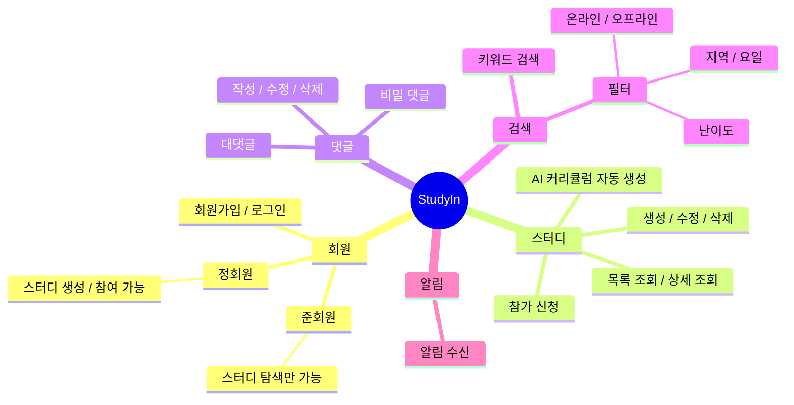
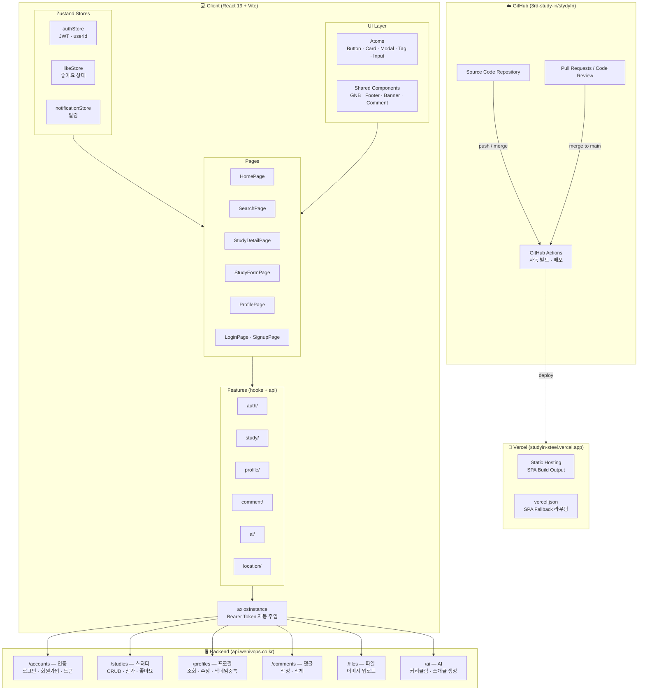

# StudyIn

> 프로그래밍 스터디를 직접 기획하고 운영하기 어려운 학습자들을 위해
> AI 초안 생성 기능과 단계별 권한 시스템을 제공하는 스터디 매칭 플랫폼

<!-- TODO: 서비스 대표 이미지 또는 배너 -->

---

## 1. 목표와 기능

### 1.1 서비스 정의

StudyIn은 프로그래밍 스터디를 직접 기획하고 운영하기 어려운 학습자들을 위해 AI 초안 생성 기능과 GitHub 연동 기반의 신뢰 시스템을 제공하는 스터디 매칭 플랫폼입니다.

### 1.2 서비스 목표

- 스터디 개설 시 발생하는 기획 및 작성 부담 완화
- 학습 데이터 기반의 신뢰도 높은 스터디 구성
- 접근 단계별 권한 설정을 통한 진성 사용자 확보

### 1.3 팀 구성

<!-- TODO: 실제 사진으로 교체 -->
<table>
  <tr>
    <th>김혜진</th>
    <th>강우석</th>
    <th>한유리</th>
    <th>조서연</th>
  </tr>
  <tr>
    <td></td>
    <td></td>
    <td></td>
    <td></td>
  </tr>
  <tr>
    <td>프로젝트 기반 설정 및 주요 페이지 구현</td>
    <td>프로젝트 초기 세팅 및 핵심 기능 개발</td>
    <td>헤더/푸터 및 공통 UI 컴포넌트 개발</td>
    <td>스터디 상세 및 댓글 기능 개발</td>
  </tr>
</table>

---

## 2. 개발 환경 및 배포 URL

### 2.1 개발 환경

**Frontend**

- Library: React 19
- Language: JavaScript
- Styling: Tailwind CSS 4
- Build Tool: Vite 7
- 상태관리: Zustand
- Auth: JWT, axiosInstance
- Linting: ESLint + Prettier

**Collaboration & Infrastructure**

- Version Control: Git, GitHub
- Deployment: Vercel
- Design: Figma

## 인증 방식

- JWT 기반 인증
- `access_token`: 1시간 유효
- `refresh_token`: 7시간 유효
- 이메일 인증 코드는 `123456` 고정 (실제 발송 없음)

### 2.2 배포 URL

- https://studyin-steel.vercel.app
- 테스트 계정
  ```
  id : test@test.com
  pw : test1234!
  ```

### 2.3 페이지 라우팅 구조

> `AuthLayout`(GNBLogin) / `GeneralLayout`(GNB 공개) / `PrivateLayout`(GNB 인증 필요) 세 가지 레이아웃으로 분리

```
/
├── [AuthLayout]
│   ├── /login                    # 로그인
│   └── /signup                   # 회원가입
│
├── [GeneralLayout]               # 비로그인도 접근 가능
│   ├── /                         # 홈 (스터디 목록)
│   ├── /search                   # 검색
│   └── /study/:studyId           # 스터디 상세
│
├── [PrivateLayout]               # 미인증 시 → /login 리다이렉트
│   ├── /study/create             # 스터디 생성
│   ├── /study/:studyId/edit      # 스터디 수정
│   ├── /profile/:userId          # 프로필
│   ├── /profile/create           # 최초 프로필 설정
│   └── /password-reset           # 비밀번호 재설정
│
└── *                             # 404
```

| 페이지          | URL                    |   접근 권한    | 설명                     |
| --------------- | ---------------------- | :------------: | ------------------------ |
| 홈              | `/`                    |      전체      | 스터디 목록 메인 페이지  |
| 검색            | `/search`              |      전체      | 키워드 및 필터 검색      |
| 스터디 상세     | `/study/:studyId`      |      전체      | 스터디 상세 정보 및 댓글 |
| 로그인          | `/login`               |    비로그인    | 로그인 페이지            |
| 회원가입        | `/signup`              |    비로그인    | 회원가입 페이지          |
| 스터디 생성     | `/study/create`        |     정회원     | 스터디 생성 폼           |
| 스터디 수정     | `/study/:studyId/edit` | 정회원(작성자) | 스터디 수정 폼           |
| 프로필          | `/profile/:userId`     |     로그인     | 마이페이지               |
| 프로필 생성     | `/profile/create`      |     로그인     | 최초 프로필 설정         |
| 비밀번호 재설정 | `/password-reset`      |     로그인     | 비밀번호 변경            |
| 404             | `*`                    |      전체      | 페이지 없음              |

### 2.4 API 엔드포인트

> Base URL: `https://api.wenivops.co.kr/services/studyin`  
> 미인증 요청 시 `401 Unauthorized` 반환

#### app:accounts

| Endpoint           | Method | 설명                 | 로그인 | 작성자 |
| ------------------ | ------ | -------------------- | :----: | :----: |
| `signup/`          | POST   | 회원가입             |        |        |
| `login/`           | POST   | 로그인               |        |        |
| `logout/`          | POST   | 로그아웃             |   ✅   |        |
| `token/refresh/`   | POST   | 만료 토큰 재발급     |        |        |
| `status/`          | GET    | 로그인 상태 확인     |        |        |
| `<int:pk>/`        | GET    | 프로필 조회          |   ✅   |        |
| `<int:pk>/`        | PATCH  | 프로필 수정          |   ✅   |   ✅   |
| `<int:pk>/`        | DELETE | 회원 탈퇴            |   ✅   |   ✅   |
| `<int:pk>/status/` | PATCH  | 준회원 → 정회원 승급 |   ✅   |        |

#### app:study

| Endpoint                 | Method | 설명           | 로그인 | 작성자 |
| ------------------------ | ------ | -------------- | :----: | :----: |
| `studies/`               | GET    | 스터디 목록    |   ✅   |        |
| `studies/`               | POST   | 스터디 생성    |   ✅   |        |
| `studies/<int:pk>/`      | GET    | 스터디 상세    |   ✅   |        |
| `studies/<int:pk>/`      | PUT    | 스터디 수정    |   ✅   |   ✅   |
| `studies/<int:pk>/`      | DELETE | 스터디 삭제    |   ✅   |   ✅   |
| `studies/<int:pk>/join/` | POST   | 참가 신청      |   ✅   |        |
| `studies/ai/`            | POST   | AI 스터디 생성 |   ✅   |        |

#### app:profile

| Endpoint            | Method | 설명        | 로그인 | 작성자 |
| ------------------- | ------ | ----------- | :----: | :----: |
| `profile/<int:pk>/` | GET    | 프로필 조회 |   ✅   |        |
| `profile/<int:pk>/` | PATCH  | 프로필 설정 |   ✅   |   ✅   |

#### app:comments

| Endpoint                     | Method | 설명          | 로그인 | 작성자 |
| ---------------------------- | ------ | ------------- | :----: | :----: |
| `studies/<int:pk>/comments/` | GET    | 댓글 목록     |   ✅   |        |
| `studies/<int:pk>/comments/` | POST   | 댓글 작성     |   ✅   |        |
| `comments/<int:pk>/`         | PATCH  | 댓글 수정     |   ✅   |   ✅   |
| `comments/<int:pk>/`         | DELETE | 댓글 삭제     |   ✅   |   ✅   |
| `comments/<int:pk>/reply/`   | POST   | 대댓글 작성   |   ✅   |        |
| `comments/<int:pk>/secret/`  | PATCH  | 비밀댓글 설정 |   ✅   |   ✅   |

#### app:search

| Endpoint         | Method | 설명        | 로그인 | 작성자 |
| ---------------- | ------ | ----------- | :----: | :----: |
| `search/`        | GET    | 키워드 검색 |   ✅   |        |
| `search/filter/` | GET    | 필터 검색   |   ✅   |        |

#### app:notifications

| Endpoint                       | Method | 설명           | 로그인 | 작성자 |
| ------------------------------ | ------ | -------------- | :----: | :----: |
| `notifications/`               | GET    | 알림 목록 조회 |   ✅   |        |
| `notifications/<int:pk>/read/` | PATCH  | 알림 읽음 처리 |   ✅   |        |

### 2.5 API 응답 데이터 타입

#### 로그인 (POST /accounts/login)

| 필드          | 타입   | 설명                             |
| ------------- | ------ | -------------------------------- |
| access_token  | string | JWT 액세스 토큰                  |
| refresh_token | string | JWT 리프레시 토큰                |
| user.pk       | number | 사용자 고유 ID                   |
| user.email    | string | 이메일                           |
| user.uid      | string | 가입 경로 식별 ID (NO\_: 이메일) |

#### 프로필 (GET /accounts/profile/:userId)

| 필드                | 타입    | 설명                           |
| ------------------- | ------- | ------------------------------ |
| user                | number  | 사용자 ID                      |
| nickname            | string  | 닉네임                         |
| name                | string  | 실명 (본인 조회 시만 제공)     |
| phone               | string  | 전화번호 (본인 조회 시만 제공) |
| profile_img         | string  | 프로필 이미지 경로             |
| introduction        | string  | 자기소개                       |
| preferred_region    | object  | 선호 지역 {id, location}       |
| github_username     | string  | GitHub 사용자명                |
| tag                 | array   | 기술 태그 목록 [{id, name}]    |
| grade               | string  | 등급                           |
| is_associate_member | boolean | 정회원 여부                    |

#### 스터디 목록 (GET /study)

| 필드                        | 타입           | 설명                         |
| --------------------------- | -------------- | ---------------------------- |
| count                       | number         | 전체 스터디 수               |
| next                        | string \| null | 다음 페이지 URL              |
| previous                    | string \| null | 이전 페이지 URL              |
| results[].id                | number         | 스터디 ID                    |
| results[].title             | string         | 스터디 제목                  |
| results[].thumbnail         | string         | 썸네일 이미지 경로           |
| results[].is_offline        | boolean        | 오프라인 여부                |
| results[].study_location    | string \| null | 스터디 장소 (온라인 시 null) |
| results[].difficulty        | object         | 난이도 {id, name}            |
| results[].subject           | object         | 주제 {id, name}              |
| results[].study_status      | object         | 모집 상태 {id, name}         |
| results[].participant_count | number         | 참가자 수                    |
| results[].user_liked        | boolean        | 좋아요 여부                  |

#### 스터디 상세 (GET /study/:studyId)

| 필드         | 타입   | 설명                     |
| ------------ | ------ | ------------------------ |
| id           | number | 스터디 ID                |
| title        | string | 스터디 제목              |
| recruitment  | number | 모집 인원                |
| study_info   | string | 스터디 소개              |
| leader       | object | 스터디장 정보            |
| study_day    | array  | 스터디 요일 [{id, name}] |
| start_date   | string | 시작일                   |
| term         | number | 기간 (주)                |
| start_time   | string | 시작 시간                |
| end_time     | string | 종료 시간                |
| search_tag   | array  | 검색 태그 [{id, name}]   |
| participants | array  | 참가자 목록              |
| like_users   | array  | 좋아요 사용자 목록       |

#### 댓글 (GET /study/:studyId/comments)

| 필드                     | 타입    | 설명                          |
| ------------------------ | ------- | ----------------------------- |
| id                       | number  | 댓글 ID                       |
| content                  | string  | 댓글 내용                     |
| is_secret                | boolean | 비밀 댓글 여부                |
| is_delete                | boolean | 삭제 여부                     |
| user.id                  | number  | 작성자 ID (비밀 댓글 시 없음) |
| user.profile.nickname    | string  | 작성자 닉네임                 |
| user.profile.profile_img | string  | 프로필 이미지 경로            |
| user.is_author           | boolean | 스터디장 여부                 |
| recomments               | array   | 대댓글 목록                   |

---

## 3. 요구사항 명세와 기능 명세

### 3.1 요구사항 명세



## 회원 등급

| 등급   | 조건             | 가능한 기능                       |
| ------ | ---------------- | --------------------------------- |
| 준회원 | 회원가입 직후    | 스터디 조회만 가능                |
| 정회원 | 프로필 설정 완료 | 스터디 생성, 참가, 댓글 작성 가능 |

### 3.2 기능 명세

| 기능 분류 | 요구사항                               | 비로그인 | 준회원 | 정회원 |
| --------- | -------------------------------------- | :------: | :----: | :----: |
| 회원      | 회원가입 / 로그인                      |    ✅    |        |        |
| 회원      | 프로필 수정                            |          |   ✅   |   ✅   |
| 스터디    | 스터디 목록 조회                       |    ✅    |   ✅   |   ✅   |
| 스터디    | 스터디 상세 조회                       |    ✅    |   ✅   |   ✅   |
| 스터디    | 스터디 생성 / 수정 / 삭제              |          |        |   ✅   |
| 스터디    | 스터디 참가 신청                       |          |        |   ✅   |
| 스터디    | AI 커리큘럼 / 소개글 자동 생성         |          |        |   ✅   |
| 댓글      | 댓글 / 대댓글 조회                     |    ✅    |   ✅   |   ✅   |
| 댓글      | 댓글 / 대댓글 작성 / 수정 / 삭제       |          |        |   ✅   |
| 댓글      | 비밀 댓글                              |          |        |   ✅   |
| 검색      | 키워드 검색                            |    ✅    |   ✅   |   ✅   |
| 검색      | 지역 / 요일 / 난이도 / 온오프라인 필터 |    ✅    |   ✅   |   ✅   |
| 알림      | 알림 수신                              |          |   ✅   |   ✅   |

---

## 4. 프로젝트 구조와 개발 일정

### 4.1 프로젝트 구조

```
src/
├── atoms/                          # 재사용 원시 컴포넌트 (비즈니스 로직 없음)
│   ├── Badge/                      # 난이도, 스터디 상태 뱃지
│   ├── Button/                     # Button, AlertButton, FlexibleButton, SideNavButton
│   ├── Card/                       # StudyListCard, MainProfileCard, MypageProfileCard 등
│   ├── DetailSectionBlock/         # 스터디 상세 섹션 블록
│   ├── DropdownSelect/             # Dropdown, Select, FilterDropdown, OptionList
│   ├── Icon/Common/                # SVG 아이콘 컴포넌트
│   ├── Images/Common/              # Image 컴포넌트
│   ├── Input/                      # InputBox, EditProfileInputBox
│   ├── Modal/                      # Modal 기본 컴포넌트
│   ├── NotificationItem/           # 알림 아이템
│   ├── ProfileCircle/              # 프로필 원형 이미지
│   ├── SearchBar/                  # 검색 바
│   └── Tag/                        # TagM2, TagSize
│
├── features/                       # 도메인별 기능 모음
│   ├── auth/                       # 로그인, 회원가입, JWT 처리
│   │   ├── hooks/                  # useLogin, useSignup, useResetPassword
│   │   ├── api.js
│   │   └── index.js
│   ├── study/                      # 스터디 목록, 상세, 생성/수정/삭제
│   │   ├── hooks/                  # useStudyList, useStudyDetail, useStudyForm, useStudyParticipate, useMyParticipatingStudies
│   │   ├── utils/                  # mapStudyToListCardProps.js
│   │   ├── api.js
│   │   └── index.js
│   ├── profile/                    # 사용자 프로필 조회 및 수정
│   │   ├── hooks/                  # useUserData
│   │   ├── api.js
│   │   └── index.js
│   ├── comment/                    # 댓글 작성 및 삭제
│   │   ├── api.js
│   │   └── index.js
│   ├── file/                       # 이미지 업로드
│   │   ├── hooks/                  # useImageUpload
│   │   └── api.js
│   ├── location/                   # Geolocation API 연동
│   │   └── hooks/                  # useGeoLocation
│   └── notification/               # 알림 조회
│       ├── api.js
│       └── index.js
│
├── shared/                         # 여러 feature에서 공통으로 사용하는 코드
│   ├── components/
│   │   ├── Banner/                 # 메인 피드 배너 슬라이더
│   │   ├── Cards/                  # StudyListCard, StudyStateCard, StudyFormSideCard 등
│   │   ├── Category/               # 주제 카테고리 아이콘
│   │   ├── Comment/                # CommentSection, CommentItem, CommentInput, ReplyItem, ReplyInput
│   │   ├── Footer/                 # Footer, FooterLogin
│   │   ├── GithubContributions/    # GitHub 잔디 컴포넌트
│   │   ├── Header/                 # GNB, GNBLogin
│   │   ├── InterestTags/           # 관심 태그 표시
│   │   ├── Modal/                  # Alert, LogoutConfirmModal, ReportModal, UserInfoModal
│   │   ├── MypageSideNav/          # 마이페이지 사이드 내비게이션
│   │   ├── NoContents/             # 빈 상태 컴포넌트
│   │   ├── Pagination/             # 페이지네이션
│   │   ├── Profile/                # 프로필 스켈레톤
│   │   ├── SearchFilter/           # 검색 필터
│   │   ├── StudyDetail/            # DetailBarTop, LeaderProfile
│   │   ├── TagInputField/          # 태그 입력 필드
│   │   ├── UserProfile/            # UserProfile, UserProfileDefault
│   │   ├── auth/                   # AuthSystem, ResetPasswordPage
│   │   └── ScrollToTopButton.jsx
│   ├── hooks/                      # useComment, useDisclosure, useToggleList
│   └── utils/
│
├── constants/                      # 고정 데이터
│   ├── api.js                      # API Base URL 등
│   ├── categories.js               # 카테고리 데이터
│   ├── difficulty.js               # 난이도 (초급 / 중급 / 고급)
│   ├── mockUpData.js               # 개발용 목업 데이터
│   ├── regions.js                  # 선호 지역 목록
│   ├── subjects.js                 # 주제 (개념학습, 프로젝트, 챌린지 등)
│   └── tags.js                     # 관심 태그 (Python, JS, React 등)
│
├── lib/
│   └── axiosInstance.js            # Bearer Token 자동 주입 axios 인스턴스
│
├── pages/                          # 라우팅 단위 페이지
│   ├── 404Page.jsx
│   ├── HomePage.jsx
│   ├── LoginPage.jsx
│   ├── PasswordResetPage.jsx
│   ├── ProfileCreatePage.jsx
│   ├── ProfilePage.jsx
│   ├── SearchPage.jsx
│   ├── SignupPage.jsx
│   ├── StudyDetailPage.jsx
│   └── StudyFormPage.jsx
│
├── stores/                         # Zustand 전역 상태
│   ├── authStore.js                # JWT, userId
│   ├── likeStore.js                # 좋아요 상태
│   └── notificationStore.js       # 알림 상태
│
├── asset/                          # 정적 리소스
│   ├── icons/                      # SVG 아이콘 (common, category)
│   ├── images/                     # 이미지 파일
│   ├── logos/                      # 로고
│   └── third-party/                # GitHub, Google 등 외부 로고
│
├── App.jsx
├── main.jsx
└── index.css
```

### 4.2 개발 일정

| 날짜         | 김혜진                                       | 한유리                     | 강우석               | 조서연                         |
| ------------ | -------------------------------------------- | -------------------------- | -------------------- | ------------------------------ |
| 2026.02.25   | 디자인 로고/파비콘/색상/폰트/아이콘 컴포넌트 | 버튼                       | 드롭다운/셀렉트      | 인풋박스/태그                  |
| 2026.02.26   | 배너 컴포넌트                                | 검색/프로필 서클           | 스터디 리스트        | User-Profile/category          |
| 2026.02.27   | 로그인/회원가입/비밀번호 찾기/페이지네이션   | 헤더/푸터                  | 빈 상태 컴포넌트     | category                       |
| 2026.02.28   | 로그인/회원가입/비밀번호 찾기                | 헤더/푸터                  | 빈 상태 컴포넌트     | category                       |
| 2026.03.03   | 로그인 기능 구현/서버 연동                   | 필터 CSS 해결/알림창       | 마이페이지           | 상세 페이지 제작(댓글 포함)    |
| 2026.03.05   | 상세 페이지/수정/스터디 만들기               | 404 페이지                 | 라우팅/마이페이지    | 상세 페이지 댓글/스터디 페이지 |
| 2026.03.09   | 마이 프로필/최초 프로필 생성/CSS 수정        | 헤더 프로필 연동/태그 연동 | 버셀 도메인          | 댓글 연동                      |
| 2026.03.09 ~ | 마이페이지 버그 수정                         | 기타 오류 수정             | 메인페이지 버그 수정 | 댓글창/검색창 버그 수정        |

---

## 5. 기획 배경 및 솔루션

### 5.1 기존 플랫폼의 문제점

- **기획 부담**: 커리큘럼 구성 및 소개글 작성의 어려움으로 인한 개설 포기 사례 발생
- **진입 장벽**: 서비스 탐색 전 강제되는 회원가입 절차로 인한 사용자 이탈
- **신뢰도 결여**: 참여자의 학습 의지를 확인할 수 있는 객관적 지표 부재

### 5.2 StudyIn의 해결책

| 비교 항목     | 기존 플랫폼 (홀라, 인프런 등)   | StudyIn                                          |
| ------------- | ------------------------------- | ------------------------------------------------ |
| 스터디 생성   | 사용자가 모든 내용을 직접 작성  | AI가 제목/주제 기반 커리큘럼 & 소개글 자동 생성  |
| 사용자 검증   | 가입 후 즉시 활동 (신뢰도 낮음) | 프로필 완성도에 따른 단계별 권한 (준회원/정회원) |
| 필터링 디테일 | 지역, 기술 스택 위주            | 요일, 난이도, 스터디 상태, 온/오프라인 세부 필터 |
| 개발자 친화성 | 일반적인 커뮤니티 성격          | GitHub 연동, 기술 태그 중심의 UI/UX              |

---

## 6. 주요 기능

### 6.1 핵심 기능

- **스터디 관리**: 스터디 생성, 수정, 삭제 및 상세 정보 조회
- **커뮤니케이션**: 댓글 시스템을 통한 스터디장과 참여자 간의 사전 Q&A
- **상세 필터링**: 지역, 요일, 난이도, 온·오프라인 여부 등 다각도 검색 지원

### 6.2 화면 설계

#### 메인페이지

|                                                                     메인페이지 - 로그인 전                                                                     |                                                                           메인페이지 - 로그인 후                                                                           |
| :------------------------------------------------------------------------------------------------------------------------------------------------------------: | :------------------------------------------------------------------------------------------------------------------------------------------------------------------------: |
|  |  |

---

#### 로그인 / 회원가입

|                                                                           로그인                                                                           |                                                                           회원가입                                                                           |
| :--------------------------------------------------------------------------------------------------------------------------------------------------------: | :----------------------------------------------------------------------------------------------------------------------------------------------------------: |
|  |  |

---

#### 프로필 설정 / 마이페이지

|                                                                           프로필 설정                                                                           |                                                                           내 프로필                                                                           |
| :-------------------------------------------------------------------------------------------------------------------------------------------------------------: | :-----------------------------------------------------------------------------------------------------------------------------------------------------------: |
|  |  |

---

#### 스터디 만들기

|                                                                           스터디 만들기                                                                           |                                                                              AI 기능                                                                               |
| :---------------------------------------------------------------------------------------------------------------------------------------------------------------: | :----------------------------------------------------------------------------------------------------------------------------------------------------------------: |
|  |  |

---

#### 스터디 상세

|                                                                          스터디 상세 (상단)                                                                          |                                                                      스터디 상세 (하단 - 댓글)                                                                       |
| :------------------------------------------------------------------------------------------------------------------------------------------------------------------: | :------------------------------------------------------------------------------------------------------------------------------------------------------------------: |
|  |  |

---

#### 검색

|                                                                           검색 화면                                                                           |                                                                           검색 결과 없음                                                                           |
| :-----------------------------------------------------------------------------------------------------------------------------------------------------------: | :----------------------------------------------------------------------------------------------------------------------------------------------------------------: |
|  |  |

---

#### 내 지역 / 온라인

|                                   내 지역 필터                                    |                                                                           온라인 필터                                                                           |
| :-------------------------------------------------------------------------------: | :-------------------------------------------------------------------------------------------------------------------------------------------------------------: |
|  |  |

---

## 7. 아키텍처



---

## 8. 협업 방식 및 개발 프로세스

### 8.1 디자인 및 컴포넌트 구현

- **디자인 토큰 활용**: `index.css` 내 색상, 폰트, 간격 변수화로 UI 일관성 유지
- **AI 협업 모델**: Figma CSS 추출 데이터와 Claude를 결합하여 오차 없는 컴포넌트 생성
- **독립적 구조 설계**: Git 충돌 방지를 위해 컴포넌트 단위 폴더 분리 및 독립 작업 수행

### 8.2 팀 운영 및 커뮤니케이션

- **자율적 역할 분담**: 큰 작업 단위 배정 후 작업자의 자율성을 존중하는 협업 방식 채택
- **기술 병목 해결**: 팀장의 리딩을 통한 문제 해결 및 원인 공유로 팀 전체의 기술 역량 상향 평준화
- **유연한 업무 환경**: 온·오프라인 병행 시 지속 가능한 작업 할당 프로세스 구축

### 8.3 팀원 역할

**kimjinx2** - 프로젝트 기반 설정 및 주요 페이지 구현

- 색상 시스템 및 타이포그래피 설정 / Icon 컴포넌트 및 SVG 아이콘 시스템 구현
- 로그인 / 회원가입 / 비밀번호 재설정 페이지 구현
- 스터디 상세 페이지 구현 / 스터디 제작 페이지 UI 개선
- Geolocation API 연결 / 다수 CSS 수정 및 버그 수정

**usewooseok97** - 프로젝트 초기 세팅 및 핵심 기능 개발

- 프로젝트 초기 세팅 / Select, Dropdown, Modal, Card 컴포넌트 제작
- Auth + Notification Zustand 스토어 구현, axiosInstance 적용
- 마이페이지 / 메인 페이지 / 검색 페이지 구현
- GPT hook 생성 / GitHub Actions CI/CD 구성

**circleoflife112** - 헤더/푸터 및 공통 UI 컴포넌트 개발

- Button / SearchBar / ProfileCircle 컴포넌트 제작
- Footer / 헤더 모달 분리 / 404 페이지 구현
- 검색 필터 및 드롭다운 컴포넌트 구현
- 헤더 미디어쿼리 반응형 처리 / 최신 검색어 노출 기능 추가

**snow7942** - 스터디 상세 및 댓글 기능 개발

- Input / Tag 컴포넌트 추가 및 파일 분리
- UserProfile 페이지 / DetailBarTop / LeaderProfile 구현
- Pagination / DetailSectionBlock 구현
- Comment API 연동 및 수정

---

## 9. 트러블슈팅

### 김혜진

**문제**

지오로케이션과 GitHub 잔디 기능을 구현하기 위해 외부 API를 연동해야 했습니다. 프로젝트에서 처음으로 API 명세 없이 외부 서비스를 직접 연결해야 했기 때문에 인증 방식, 요청 구조, 데이터 활용 방법을 파악하는 과정이 어려웠습니다.

**해결**

지오로케이션 기능은 카카오에서 제공하는 API를 활용하여 구현했고, JavaScript 키를 발급받아 프로젝트에 연동했습니다. 또한 GitHub 잔디 표시 기능도 외부 API를 조사하고 사용 방법과 데이터 구조를 학습한 뒤 프로젝트에 맞게 연결했습니다.

**해결 후 느낀점**

외부 API 문서를 직접 확인하며 인증 방식과 사용 방법을 이해하는 과정을 통해 API 연동 경험을 쌓을 수 있었습니다.

---

### 강우석

**문제**

os별 레이아웃 픽셀 오차 발생

**해결**

우선 어디가 원인인지 주요 원인들을 gemini로 리스트를 뽑은후 직접 화면 공유를 통해 비교하면서 원인을 찾게되었다.
스크롤바의 공간 차지 방식이 원인임을 알게 되고 이로 인해 브라우저의 실제 렌더링 영역(Viewport)이 스크롤바 너비만큼 줄어듭니다.

Windows (LG 그램): 기본적으로 스크롤바가 물리적인 너비(약 15~17px)를 차지.
macOS (맥북 에어): 기본적으로 스크롤바가 화면 위에 떠 있는 형태(Overlay)이거나 스크롤할 때만 나타납니다. 따라서 레이아웃 너비에 영향을 주지 않습니다.
라는 정보를 알게되고
거기다 UX적으로도 사용자가 스크롤이 가능할수있는 페이지라고 판단할수있도록 콘텐츠가 잘린채로 표시되는경우가 대부분이기 때문에 스크롤을 css적으로 없애기위해
전역 CSS 파일의 최상단에
html, body {
-ms-overflow-style: none; /_ For Internet Explorer and older Edge _/
scrollbar-width: none; /_ For Firefox _/
}
html::-webkit-scrollbar,
body::-webkit-scrollbar {
display: none; /_ Hides the scrollbar visually _/
}
를 추가하여 해결하였습니다.

---

### 한유리

**문제**

스터디 생성시, 사용자 프로필 작성시 설정한 이미지 데이터가 없을 시 엑박(Broken Image) 현상 발생

**해결**

1. 단축 평가(Short-circuit evaluation)를 통한 초기 할당
   src={image || MainThumbnail}
   image 값이 undefined, null, 또는 빈 문자열("")일 경우, 논리 연산자 || 뒤에 있는 MainThumbnail을 기본값으로 할당합니다.
   컴포넌트가 처음 렌더링될 때 데이터가 비어있다면 즉시 기본 이미지를 보여줍니다.
2. onError 핸들러를 통한 런타임 예외 처리
   onError={(e) => {
   e.currentTarget.src = MainThumbnail;
   }}
   이미지 태그()의 onError 이벤트를 사용했습니다.
   image 경로가 존재는 하지만 URL이 잘못되었거나, 서버 문제로 이미지를 불러오지 못해 '엑박'이 뜨는 상황에서 실행됩니다. 이때 자바스크립트를 통해 src를 강제로 기본 이미지 경로로 교체하여 사용자에게 깨진 화면을 보여주지 않게 합니다.

---

### 조서연

**문제**

1. 대댓글에서 답글달기 클릭 시 존재하지 않는 comment_id로 요청을 보내 "Comment를 찾을 수 없습니다" 404 오류 발생하였습니다. API 구조상 대대댓글이 없기 때문에 대댓글의 답글도 최상위 댓글 id로 요청해야 했으나 이를 인지하지 못해 발생한 문제였습니다.
2. 비밀댓글에 달린 대댓글의 공개 여부 조건이 복잡하여 누가 볼 수 있는지 기준이 불명확했습니다. 부모 댓글이 비밀이면 대댓글도 비밀로 처리해야 하는데 단순 isMine 체크로는 부족했습니다.

**해결**

1. ReplyItem에 onReply prop을 추가하고 CommentSection에서 항상 최상위 comment.id를 전달하도록 수정, 멘션은 대댓글 작성자 닉네임으로 유지하였습니다. 또한, API 구조 파악 후 프론트에서 id를 올바르게 매핑하여 해결했습니다.
2.  canViewSecret 조건을 부모 댓글 비밀 여부에 따라 분기 처리하여 부모 댓글이 비밀인 경우 대댓글 작성자만, 일반 댓글인 경우 대댓글 작성자/부모 댓글 작성자/그룹장 모두 볼 수 있도록 세분화하였습니다. 또한, 그룹장/댓글 작성자/대댓글 작성자 세 케이스를 모두 고려하여 조건 설계했습니다.

---

## 10. 개발하며 느낀점

### 김혜진

React에 서툴어서 개발 속도를 따라가는 것이 쉽지 않았지만, API명세나 Geolocation API와 잔디 API같은 외부 데이터를 연동하며 서비스를 구체화하는 작업이 정말 흥미로웠습니다. 특히 컴포넌트를 atom 단위로 세밀하게 쪼개고 하나하나 연결해보며 원리를 익히는 과정은 낯설고 도전적이었지만, 이 과정을 통해 컴포넌트의 재사용성에 대해 배울 수 있었습니다. 협업 과정에서 각자의 역할이 명확했던 덕분에 충돌이나 소통 비용을 줄이고, 각자 맡은 바를 해나가며 효율적이게 프로젝트를 완주할 수 있었습니다. 끝내 좋은 결과물을 낼 수 있어서 기쁩니다.

### 강우석

처음 프로젝트를 시작할 때 Figma 디자인 스펙을 보며 컴포넌트를 어떻게 나눌지 고민했던 기억이 납니다. DropdownSelect를 하나의 파일에 variant prop으로 분기할지, 디자인 단위 그대로 3개 파일로 나눌지 결정하면서 "코드 구조가 팀 전체의 생산성에 직접 영향을 미친다"는 걸 체감했습니다. 공통 로직을 \_shared.jsx 하나로 뽑아두고 나서 나중에 수정이 필요할 때 한 곳만 바꾸면 됐을 때의 편안함은 아직도 기억에 남습니다.

Modal 시스템을 설계할 때도 비슷한 고민이 있었습니다. 베이스 래퍼는 atoms에, 복합 모달은 shared/components에 두는 레이어 분리를 고집했고, 그 덕분에 팀원들이 ESC·배경 클릭 같은 닫기 동작을 각자 중복 구현하지 않아도 됐습니다. 설계 결정 하나가 팀 전체의 코드 중복을 줄이는 경험은 프론트엔드 아키텍처에 대한 관심을 더 키워줬습니다.

개인적으로 가장 애를 먹었던 부분은 GPS 기반 위치 인증 기능이었습니다. GPS가 반환하는 좌표를 백엔드 지역 데이터와 매칭하는 로직, 동의/미동의 상태에 따른 UI 분기, localStorage에 동의 상태를 유지하는 처리까지 여러 요소가 얽혀있었고, "내지역 인증하기 버튼 버그 진짜 해결함"이라는 커밋 메시지에서 볼 수 있듯 꽤 오랫동안 붙잡고 있었습니다. 결국 해결했을 때의 성취감은 컸습니다.

좋아요 기능에서 메인 페이지와 디테일 페이지의 상태를 연동하거나, 마이페이지 전체 흐름을 책임지면서 API 응답의 null 필드 처리, 전화번호 인증 재진입 로직 같은 세부 엣지케이스들을 하나씩 잡아나가는 과정도 실제 서비스에서 마주치는 문제의 복잡성을 실감하게 해줬습니다.

팀원들과 브랜치를 나눠 작업하고 PR을 통해 코드를 합치는 협업 방식도 처음에는 낯설었지만, 충돌을 해결하고 서로의 코드를 리뷰하면서 "혼자였다면 이렇게 빠르게 완성되지 못했겠다"는 생각이 자연스럽게 들었습니다. 컴포넌트들이 모여 하나의 서비스로 완성되어 가는 과정을 팀과 함께 경험한 것이 이번 프로젝트에서 가장 값진 부분이었습니다.

### 한유리

React 컴포넌트 기반의 설계 방식을 적용하며, 프로젝트가 점진적으로 빌드업되는 과정을 직접 경험한 것이 매우 흥미로웠습니다.
Api 연동 개념도 팀원들의 자문과 cli를 이용한 로직 작성을 반복하니 조금씩 체득이 되었습니다. 아직 해당 개념에 대한 깊은 이해와, 초기 파일 구조 설계, 환경 세팅 등 여전히 탐구해야 할 영역이 많지만, 컴포넌트들이 모여 하나의 온전한 서비스로 완성되어 가는 과정을 통해 프론트엔드 개발의 매력과 깊은 성취감을 느꼈습니다. 팀원들과 오류를 찾아 해결해 나가는 과정도 즐거웠습니다.

### 조서연

댓글, 대댓글, 검색 필터 등 사용자와 직접 상호작용하는 기능을 처음 구현해보면서 API 응답 데이터를 UI에 맞게 가공하고 연결하는 과정이 낯설고 어려웠지만 그만큼 신기하고 흥미로웠습니다. 아직 역량이 부족하여 전체 개발 과정에서 더 많은 것을 흡수하지 못한 점이 아쉽지만, 비밀 댓글 가시성 조건이나 삭제된 댓글 처리처럼 예외 케이스를 하나씩 찾아 해결해 나가는 과정을 통해 문제를 직접 추적하고 해결하는 경험을 할 수 있었습니다. 팀원들과 함께 오류를 찾아 해결해 나가는 과정을 통해 협업의 중요성과 프론트엔드 개발의 재미를 느낄 수 있었습니다.
